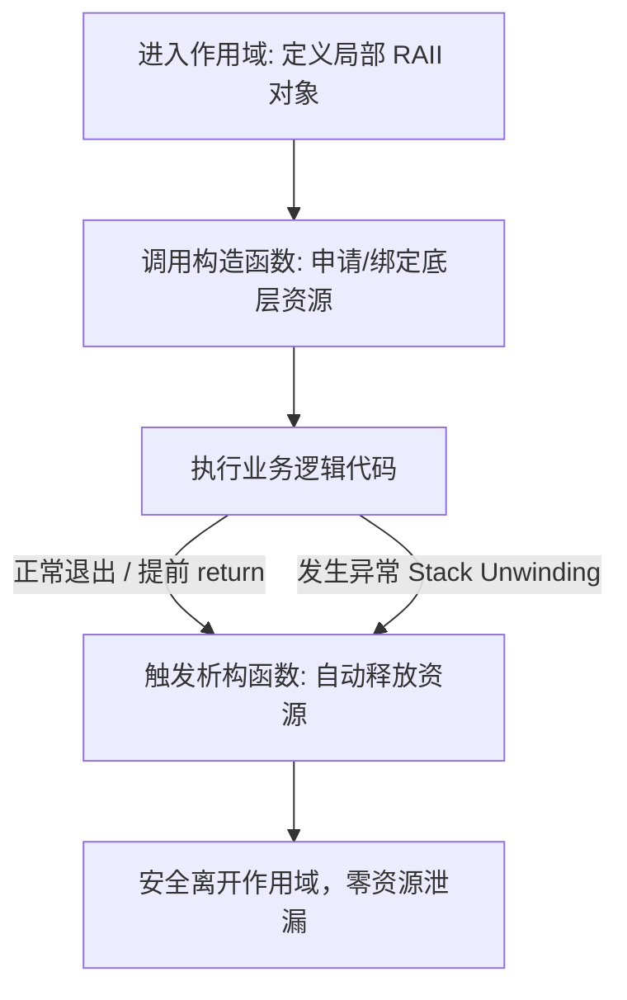

# C++ RAII 机制全解析与实践指南

---

## 一、什么是 RAII？

**RAII** 全称是 **Resource Acquisition Is Initialization**（**资源获取即初始化**），由 C++ 之父 Bjarne Stroustrup 提出。

它是现代 C++ 中最核心的资源管理机制之一。

### 1. 核心哲学
> **将“资源的生命周期”与“对象的生命周期”深度绑定。**
> - **构造函数获取资源**：在对象创建（初始化）时分配/绑定资源（如堆内存、文件描述符、互斥锁、Socket 等）。
> - **析构函数释放资源**：在对象销毁（离开作用域）时自动释放资源。
> - **依靠栈对象的确定性析构**：利用 C++ 语言保证局部变量离开作用域时必然调用析构函数的机制，实现 100% 可靠的自动化资源回收。

### 2. 形象比喻
* **传统手动管理（C 风格）**：进图书馆借书，走的时候必须记得排队还书。如果遇到突发紧急情况从安全通道撤离，书就丢了（资源泄漏）。
* **RAII 机制（C++ 风格）**：进酒店插房卡取电，出门拔卡全屋自动断电。只要离开房间（离开作用域），系统自动替你完成清理工作。

---

## 二、为什么需要 RAII？（痛点分析）

在没有 RAII 的传统编程中，资源管理主要面临两大杀手：**多分支遗漏** 与 **异常抛出导致资源泄漏**。

### 1. ❌ 痛点反面示例：手动释放的脆弱性

```cpp
void riskyFunction(int code) {
    // 1. 获取资源
    int* buffer = new int[1024];
    FILE* fp = fopen("log.txt", "w");
    g_mutex.lock();

    // 2. 业务逻辑分支
    if (code < 0) {
        // ❌ 错误 1：提前 return，遗漏了 fclose 和 g_mutex.unlock()，导致文件未刷盘与死锁！
        delete[] buffer;
        return;
    }

    if (code == 99) {
        // ❌ 错误 2：抛出异常导致栈展开，直接跳过了下方的所有释放代码！
        throw std::runtime_error("Unexpected error!");
    }

    // 3. 正常清理
    g_mutex.unlock();
    fclose(fp);
    delete[] buffer;
}
```

手动管理的致命缺陷：
1. **代码冗余**：每个可能的 `return` 分支都必须重复编写清理代码。
2. **异常不安全**：一旦抛出异常，所有后续手动 `delete`/`unlock`/`fclose` 都会被跳过。
3. **维护成本高**：后续维护人员添加新的 `if` 分支或调用可能抛异常的函数时，极易引入新的泄漏 bug。

---

## 三、RAII 的底层支撑：作用域与栈展开（Stack Unwinding）

C++ 标准明确规定：
> **无论函数是因为正常执行完毕、`return` 提前返回，还是中途抛出异常，只要退出当前作用域（`{}`），所有已构造完成的局部栈对象必定会按照构造的逆序依次调用析构函数。**



---

## 四、经典手写 RAII 实现案例

### 案例 1：文件句柄包装器（FileGuard）

```cpp
#include <iostream>
#include <cstdio>
#include <string>

class FileGuard {
private:
    FILE* m_file = nullptr;

public:
    // 1. 构造函数：获取资源
    explicit FileGuard(const char* filename, const char* mode) {
        m_file = fopen(filename, mode);
        if (!m_file) {
            std::cerr << "Failed to open file: " << filename << std::endl;
        }
    }

    // 2. 析构函数：释放资源
    ~FileGuard() {
        if (m_file) {
            fclose(m_file);
            std::cout << "[RAII] File closed safely." << std::endl;
        }
    }

    // 3. 禁用拷贝语义（独占所有权，防止二次 double fclose）
    FileGuard(const FileGuard&) = delete;
    FileGuard& operator=(const FileGuard&) = delete;

    // 4. 支持移动语义（所有权转移）
    FileGuard(FileGuard&& other) noexcept : m_file(other.m_file) {
        other.m_file = nullptr;
    }
    FileGuard& operator=(FileGuard&& other) noexcept {
        if (this != &other) {
            if (m_file) fclose(m_file);
            m_file = other.m_file;
            other.m_file = nullptr;
        }
        return *this;
    }

    // 提供安全操作
    void write(const std::string& str) {
        if (m_file) {
            fputs(str.c_str(), m_file);
        }
    }
};

void testFile() {
    FileGuard file("data.txt", "w");
    file.write("Hello RAII!\n");
    // 函数退出时 file 自动析构，文件安全关闭
}
```

---

### 案例 2：简易互斥锁保护器（LockGuard）

模拟 `std::lock_guard` 的核心机制：

```cpp
#include <iostream>
#include <mutex>

class CustomLockGuard {
private:
    std::mutex& m_mtx;

public:
    // 构造时加锁
    explicit CustomLockGuard(std::mutex& mtx) : m_mtx(mtx) {
        m_mtx.lock();
        std::cout << "[RAII] Mutex locked." << std::endl;
    }

    // 析构时解锁
    ~CustomLockGuard() {
        m_mtx.unlock();
        std::cout << "[RAII] Mutex unlocked." << std::endl;
    }

    // 禁用拷贝
    CustomLockGuard(const CustomLockGuard&) = delete;
    CustomLockGuard& operator=(const CustomLockGuard&) = delete;
};

std::mutex g_mtx;

void safeWorker(int value) {
    CustomLockGuard lock(g_mtx); // 构造即加锁
    
    if (value < 0) {
        return; // 提前返回，lock 离开作用域自动析构解锁，绝无死锁隐患！
    }
    
    std::cout << "Working with value: " << value << std::endl;
} // 正常离开作用域，自动析构解锁
```

---

### 案例 3：简易独占智能指针（MyUniquePtr）

```cpp
template <typename T>
class MyUniquePtr {
private:
    T* m_ptr = nullptr;

public:
    explicit MyUniquePtr(T* ptr = nullptr) : m_ptr(ptr) {}

    ~MyUniquePtr() {
        delete m_ptr;
        m_ptr = nullptr;
    }

    // 禁用拷贝
    MyUniquePtr(const MyUniquePtr&) = delete;
    MyUniquePtr& operator=(const MyUniquePtr&) = delete;

    // 允许移动
    MyUniquePtr(MyUniquePtr&& other) noexcept : m_ptr(other.m_ptr) {
        other.m_ptr = nullptr;
    }

    MyUniquePtr& operator=(MyUniquePtr&& other) noexcept {
        if (this != &other) {
            delete m_ptr;
            m_ptr = other.m_ptr;
            other.m_ptr = nullptr;
        }
        return *this;
    }

    // 重载解引用运算符
    T& operator*() const { return *m_ptr; }
    T* operator->() const { return m_ptr; }
    T* get() const { return m_ptr; }
};
```

---

## 五、现代 C++ 标准库中的 RAII 设施

在现代 C++（C++11 及以后）中，几乎所有资源都有对应的 RAII 标准包装器：

| 资源类别 | 原始危险方式（❌） | 标准库 RAII 类（✅ 推荐） |
| :--- | :--- | :--- |
| **动态内存（独占）** | `T* p = new T;` / `delete p;` | `std::unique_ptr<T>` (配合 `std::make_unique`) |
| **动态内存（共享）** | 引用计数指针手动编写 | `std::shared_ptr<T>` (配合 `std::make_shared`) |
| **动态数组** | `int* arr = new int[n];` | `std::vector<T>`, `std::string` |
| **互斥锁（基本保护）** | `mtx.lock();` / `mtx.unlock();` | `std::lock_guard<std::mutex>` |
| **互斥锁（灵活控制）** | 手动管理锁状态与条件变量 | `std::unique_lock<std::mutex>` |
| **多锁防死锁** | 多个 `mtx.lock()` | `std::scoped_lock` (C++17) |
| **文件 I/O** | `fopen` / `fclose` | `std::ifstream`, `std::ofstream`, `std::fstream` |

---

## 六、RAII 核心设计法则与避坑指南

### 1. 严格遵守 Rule of Zero / Three / Five
* 如果类管理了裸资源，必须明确定义：
  - **析构函数**（负责释放）
  - **拷贝构造/拷贝赋值**（若不支持深拷贝，必须明确 `= delete` 禁用，否则浅拷贝会导致二次释放 Crash）
  - **移动构造/移动赋值**（若需要支持所有权转移）

### 2. 析构函数绝不可抛出异常（必须 `noexcept`）
* C++ 析构函数默认带有 `noexcept`。
* **原因**：如果栈展开（因为之前抛出异常）过程中，某个 RAII 对象的析构函数又抛出了新异常，此时存在两个同时活跃的异常，C++ 会直接调用 `std::terminate()` 强制使整个进程崩溃。

### 3. 必须在栈上创建 RAII 对象
* RAII 的魔力来源于**栈对象的自动生命周期管理**。
* 如果把 RAII 对象本身通过 `new` 创建在堆上（如 `auto* p = new std::lock_guard(...)`），则完全违背了 RAII 的初衷，退化为手动管理。

### 4. 优先“Rule of Zero”
* 尽可能利用标准库现成的 RAII 容器和智能指针（`std::vector`, `std::string`, `std::unique_ptr`）作为成员变量。此时编译器自动生成的默认析构和移动操作都是正确的，无需手写任何析构代码。

---

## 七、速查与总结口诀

> 📌 **RAII 三字经**：
> - **构造拿，析构放；**
> - **栈管理，无漏网；**
> - **禁浅拷，移所有；**
> - **无生针，异常爽。**
